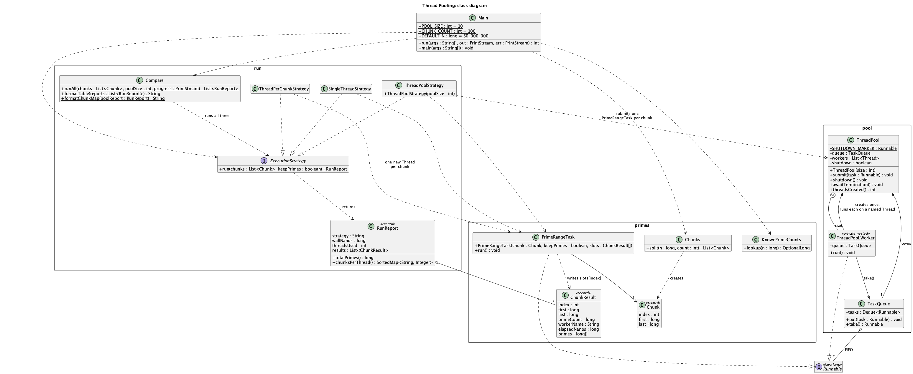
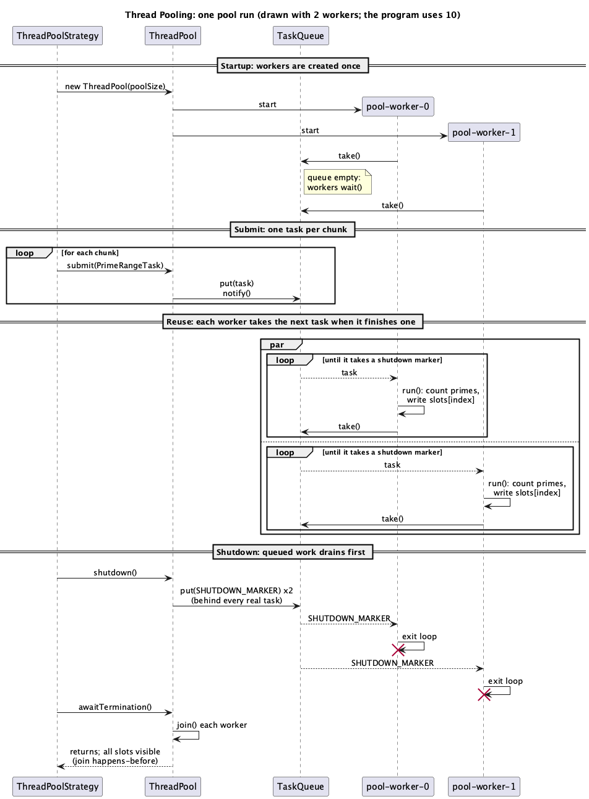

# Design: class and sequence diagrams

Both diagrams are written in PlantUML. The `.puml` files are the source; the `.png` files are rendered from them. The sequence diagram also has a plain-text rendering (`.utxt`) for reading in a terminal. To re-render after a change:

```bash
java -jar plantuml.jar -tpng uml/pool/*.puml
java -jar plantuml.jar -utxt uml/pool/thread-pooling-sequence.puml
```

## Class diagram



Source: [thread-pooling-class.puml](thread-pooling-class.puml)

The program has three packages, and the diagram groups the classes that way.

`pool` is the tactic. `ThreadPool` creates its workers once, in its constructor, and keeps them for the life of the pool. Each worker is a `ThreadPool.Worker`, a private nested class that runs on its own named thread (`pool-worker-0` up to `pool-worker-9`). Workers never talk to the code that submits work. Both sides only touch `TaskQueue`, a first-in, first-out queue we wrote by hand with `synchronized`, `wait()` and `notify()`. `submit` puts a task on the queue, and a worker takes it off. Nothing in this package comes from `java.util.concurrent`, because the assignment rules out library thread pools.

`primes` is the work. `Chunks.split` cuts [1, N] into 100 equal ranges, and each range becomes a `PrimeRangeTask`, which is just a `Runnable`. The pool has no idea it's counting primes, and we liked keeping it that way: it would run any `Runnable` you gave it. Each task writes its `ChunkResult` into its own slot of a shared array, so no two tasks ever write to the same place and the results need no locking.

`run` is how we measure the tactic. The three `ExecutionStrategy` implementations run the same chunks three ways: all on one thread, on the pool, or on one new thread per chunk. Each returns a `RunReport`, and `Compare` runs all three and prints them side by side. Only `ThreadPoolStrategy` uses the pool. The other two exist so the pool has something to be measured against; a speedup number on its own wouldn't tell you much.

`Main` reads the command line and picks a strategy, or `Compare`. The pool size (10) and chunk count (100) are constants in `Main` rather than options, because the assignment fixes the pool at 10 threads.

## Sequence diagram



Source: [thread-pooling-sequence.puml](thread-pooling-sequence.puml) · Text version: [thread-pooling-sequence.utxt](thread-pooling-sequence.utxt)

This is one run of `ThreadPoolStrategy`. It is drawn with two workers to keep it readable; the real program has ten, and they all behave the same way.

1. Creating the pool starts both worker threads, once. Each one immediately calls `take()`, finds the queue empty, and waits.
2. The strategy submits a `PrimeRangeTask` for every chunk. Each `put` wakes one waiting worker, since one task can only go to one worker.
3. This is the part of the diagram that matters most for the assignment, which asks that a thread be reused for the next piece of work. A worker takes a task, runs it, writes its result, and goes straight back to `take()` for the next one. It isn't destroyed and recreated between tasks. The two loops run at the same time (the `par` frame), and a worker that drew a cheaper chunk simply comes back sooner and takes more of them. With 100 chunks and 10 workers, each worker ends up running about ten.
4. `shutdown()` adds one marker per worker to the back of the queue, behind every real task. Because the queue is first-in, first-out, a worker only reaches its marker after all the real work has been handed out. When a worker takes its marker, it leaves its loop and the thread ends.
5. `awaitTermination()` joins each worker thread. In Java, everything a thread did before it ended is visible to the thread that joins it, so once the joins return, the strategy can safely read every result slot.

Two rules didn't fit in the drawing but are in the code and the tests. A task that throws an exception is reported on one line of standard error, and its worker carries on, so one bad task can't shrink the pool. (An `Error`, like running out of memory, is different: the worker stops, because the JVM itself is in trouble.) And a worker that is interrupted stops after its current task, even when more work is queued.

## How this maps to the course

The textbook doesn't have a tactic named "thread pooling." The closest fit is Introduce Concurrency: processing different sets of activities on additional threads so they can be handled in parallel (Bass et al. 141). The pool also follows Schedule Resources, because when a resource has more demand than it can serve at once, some policy has to decide who goes next (Bass et al. 142). Ours is first-in, first-out: chunks are handed out in the order they were submitted, to whichever worker asks first. The textbook also lists thread pools among the software resources that have to be managed (Bass et al. 138). That is what the pool does here: it caps the program at ten worker threads no matter how much work arrives. Bound Queue Sizes (Bass et al. 142) is a related tactic that we did not apply. Our queue is unbounded, because the program always submits exactly 100 tasks, so a limit would add nothing.

The sequence diagram shows separate threads as separate lifelines, the same way the course's heartbeat design did (Hawker et al., slide 10).

## Works Cited

Bass, Len, Paul Clements, and Rick Kazman. *Software Architecture in Practice*. 4th ed., Addison-Wesley, 2022.

Hawker, J. Scott, R. Kuehl, and M. Mirakhorli. "Availability Tactics -- HeartBeat." SWEN-755 Software Architecture, Rochester Institute of Technology, lecture slides.
